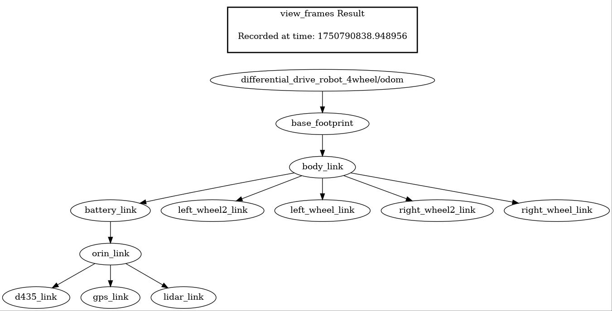
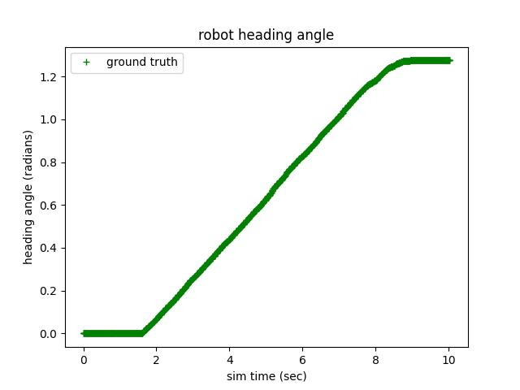

# differential_drive_test

A ROS2 package/node for orchestrating tests of ROS2 simulation nodes and collecting results.

## Installation

## Usage

## Simulator Comparisons

### Transform trees

<table>
  <tr>
    <td align="center"><b>Gazebo</b></td>
  </tr>
  <tr>
    <td></td>
  </tr>
  <tr>
    <td align="center"><b>IsaacSim</b></td>
  </tr>
  <tr>
    <td></td>
  </tr>
</table>

### Sensors - Depth Camera

<table>
  <tr>
    <td align="center"><b>Gazebo</b></td>
    <td align="center"><b>IsaacSim</b></td>
  </tr>
  <tr>
    <td></td>
    <td></td>
  </tr>
</table>

### Sensors - RGB Camera

<table>
  <tr>
    <td align="center"><b>Gazebo</b></td>
    <td align="center"><b>IsaacSim</b></td>
  </tr>
  <tr>
    <td></td>
    <td></td>
  </tr>
</table>

### Sensors - Lidar

<table>
  <tr>
    <td align="center"><b>Gazebo</b></td>
    <td align="center"><b>IsaacSim</b></td>
  </tr>
  <tr>
    <td></td>
    <td></td>
  </tr>
</table>

### Dynamics - Open-Loop control 0m (in-place pivot) radius turn
<!-- TEST4_TABLE_START -->
| sim_type   | odom turn radius(m)   |   gt turn radius(m) | odom heading change(rad)   |   gt heading change(rad): |   sim time change(s) |   wall time change(s) |
|:-----------|:----------------------|--------------------:|:---------------------------|--------------------------:|---------------------:|----------------------:|
| gazebo     | 0                     |                0.04 | 5.01                       |                      5.06 |                10.01 |                 14.51 |
| isaacsim   | -                     |                0.12 | -                          |                      0.94 |                10    |                 24.48 |
<!-- TEST4_TABLE_END -->

<table>
  <tr>
    <td align="center"><b>Gazebo</b></td>
    <td align="center"><b>IsaacSim</b></td>
  </tr>
  <tr>
    <td></td>
    <td></td>
  </tr>
</table>

<table>
  <tr>
    <td align="center"><b>Gazebo</b></td>
    <td align="center"><b>IsaacSim</b></td>
  </tr>
  <tr>
    <td></td>
    <td></td>
  </tr>
</table>

### Dynamics - Open-Loop control 1m radius turn

<!-- TEST1_TABLE_START -->
| sim_type   | odom turn radius(m)   |   gt turn radius(m) | odom heading change(rad)   |   gt heading change(rad): |   sim time change(s) |   wall time change(s) |
|:-----------|:----------------------|--------------------:|:---------------------------|--------------------------:|---------------------:|----------------------:|
| gazebo     | 1.0                   |                1    | 5.0                        |                      4.96 |                10.03 |                 14.63 |
| isaacsim   | -                     |               46.16 | -                          |                      0.12 |                10.02 |                 24.27 |
<!-- TEST1_TABLE_END -->

<table>
  <tr>
    <td align="center"><b>Gazebo</b></td>
    <td align="center"><b>IsaacSim</b></td>
  </tr>
  <tr>
    <td></td>
    <td></td>
  </tr>
</table>

<table>
  <tr>
    <td align="center"><b>Gazebo</b></td>
    <td align="center"><b>IsaacSim</b></td>
  </tr>
  <tr>
    <td></td>
    <td></td>
  </tr>
</table>

### Dynamics - Open-Loop control 2m radius turn
<!-- TEST2_TABLE_START -->
| sim_type   | odom turn radius(m)   |   gt turn radius(m) | odom heading change(rad)   |   gt heading change(rad): |   sim time change(s) |   wall time change(s) |
|:-----------|:----------------------|--------------------:|:---------------------------|--------------------------:|---------------------:|----------------------:|
| gazebo     | 2.0                   |                1.97 | 2.51                       |                      2.44 |                10.04 |                 14.67 |
| isaacsim   | -                     |              297.86 | -                          |                      0.02 |                10.05 |                 24.38 |
<!-- TEST2_TABLE_END -->

<table>
  <tr>
    <td align="center"><b>Gazebo</b></td>
    <td align="center"><b>IsaacSim</b></td>
  </tr>
  <tr>
    <td></td>
    <td></td>
  </tr>
</table>

<table>
  <tr>
    <td align="center"><b>Gazebo</b></td>
    <td align="center"><b>IsaacSim</b></td>
  </tr>
  <tr>
    <td></td>
    <td></td>
  </tr>
</table>

### Dynamics - Open-Loop control 4m radius turn
<!-- TEST3_TABLE_START -->
| sim_type   | odom turn radius(m)   |   gt turn radius(m) | odom heading change(rad)   |   gt heading change(rad): |   sim time change(s) |   wall time change(s) |
|:-----------|:----------------------|--------------------:|:---------------------------|--------------------------:|---------------------:|----------------------:|
| gazebo     | 4.0                   |                4.46 | 1.25                       |                       1.2 |                10.01 |                 14.72 |
| isaacsim   | -                     |             1253.09 | -                          |                       0   |                10.05 |                 24.41 |
<!-- TEST3_TABLE_END -->

<table>
  <tr>
    <td align="center"><b>Gazebo</b></td>
    <td align="center"><b>IsaacSim</b></td>
  </tr>
  <tr>
    <td></td>
    <td></td>
  </tr>
</table>

<table>
  <tr>
    <td align="center"><b>Gazebo</b></td>
    <td align="center"><b>IsaacSim</b></td>
  </tr>
  <tr>
    <td></td>
    <td></td>
  </tr>
</table>

### Gazebo Sensor and data publish rates

<!-- GAZEBO_DATA_RATE_TABLE_START -->
| topic                        |   count |   wall Hz |   sim Hz |
|:-----------------------------|--------:|----------:|---------:|
| /imu                         |     399 |     13.49 |    20.05 |
| /d435_rgb_camera/image_raw   |     605 |     20.43 |    30.35 |
| /d435_depth_camera/image_raw |     605 |     20.43 |    30.35 |
| /scan                        |     200 |      6.76 |    10.05 |
| /odom                        |    1993 |     67.33 |   100.05 |
| /clock                       |   19926 |    672.34 |  1000.05 |
| /tf                          |    2391 |     80.83 |   120.09 |
| /gt_pose                     |    1462 |     49.37 |    73.42 |
<!-- GAZEBO_DATA_RATE_TABLE_END -->

### IsaacSim Sensor and data publish rates
<!-- ISAAC_DATA_RATE_TABLE_START -->
| topic               |   count |   wall Hz |   sim Hz |
|:--------------------|--------:|----------:|---------:|
| /imu                |     398 |     50.09 |   120.61 |
| /rgb_camera/rgb     |     200 |     25.1  |    60.3  |
| /depth_camera/depth |     200 |     25.1  |    60.3  |
| /scan               |     398 |     50.09 |   120.61 |
| /odom               |     398 |     50.09 |   120.61 |
| /clock              |     398 |     50.12 |   120.61 |
| /tf                 |    1194 |    150.24 |   361.82 |
<!-- ISAAC_DATA_RATE_TABLE_END -->
