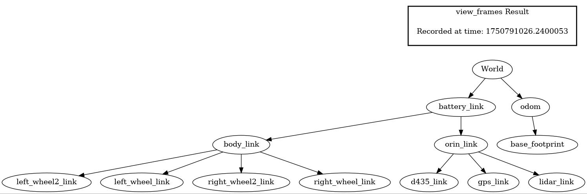
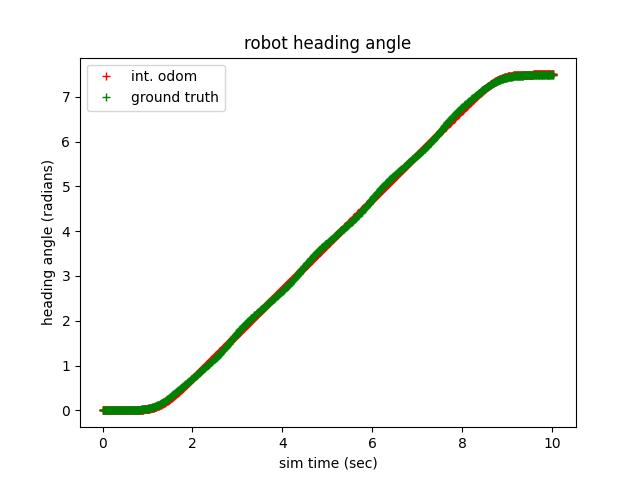
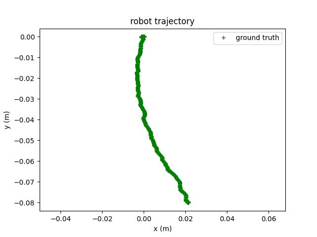
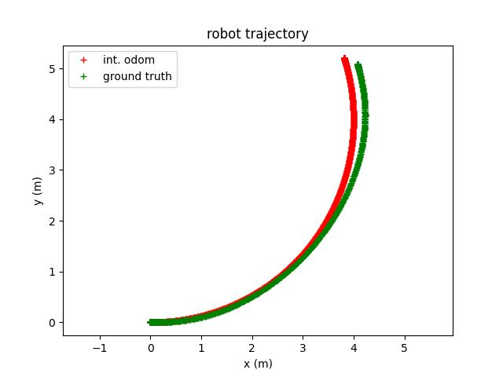

# differential_drive_test

A ROS2 package/node for orchestrating tests of ROS2 simulation nodes and collecting results. Different simulators are ... different ... , and yet we want similar results - presumably. This repo tests some of the behaviors of at least 2 simulators, with the comparison results published back into this README.md on demand (see the Usage section below).

## Installation/Dependencies

Nodes and scripts in this ROS2 package depend upon other ROS2 packages. It is suggested all these repos/packages share the same ROS2 workspace. 

The other ROS2 packages / GitHub repos called by this package are:

[gazebo simulation](https://github.com/StuartGJohnson/gazebo_differential_drive_robot_4wheel)

[isaacsim simulation](https://github.com/StuartGJohnson/isaacsim_differential_drive_robot_4wheel)

The world generation repo is used to generate worlds for robot testing and exploration:

[WorldGeneration](https://github.com/StuartGJohnson/WorldGeneration)

See also:
- [requirements.txt](requirements.txt)
- [ros2_pkg_list.txt](ros2_pkg_list.txt)

## Usage

The core functionality of this package is in `scripts/check_robot_sim.py`. This ROS2 node is executed as follows:
- Set the appropriate parameters in, for example,`config/sim_check_gazebo.yml`
- Run each series of tests via:
  <pre>ros2 run differential_drive_test check_robot_sim.py --config config/sim_check_gazebo.yml</pre>
  or
  <pre>ros2 run differential_drive_test check_robot_sim.py --config config/sim_check_isaac.yml</pre>
- Update the appropriate parameters in, for example, `config/publish.yml`
  - Note this configuration file is typically updated to process the last, uniquely labeled, time-stamped directories of results generated by the simulator runs.
- Run the publish node:
  <pre>ros2 run differential_drive_test publish_results_node.py --config config/publish.yml</pre>
    - the publish operation updates tables in this file, but only in tagged sections
    - you may wish to push updates to GitHub. The updates will include simulator output files, copied into this repo by the publish node

These scripts produce various results:
- Robot selfies
- Simulator publish rates of numerous topics, in simulation and wall time
- Simulator/robot transform trees
- Open-loop dynamics tests
- Sensor outputs of RGB camera, depth camera, and lidar. Currently, these are static outputs, collected near the beginning of simulation - after a short post-start-up delay.

As noted above, running the publish node will update tables (and figures) in this README.md.

## Simulator Comparisons

### Robot self portrait

The selfies are taken with the robot's own camera, by translating and rotating the camera pose relative to the camera body. Note I have not had time to resolve viewpoint differences - Gazebo and IsaacSim have different coordinate systems. Sun angles are different - these are controlled by code in the WorldGeneration repo and need to be updated for simulator differences. Robot colors and textures have not survived translation from Gazebo->IsaacSim.

#### RGB Camera
<table>
  <tr>
    <td align="center"><b>Gazebo</b></td>
    <td align="center"><b>IsaacSim</b></td>
  </tr>
  <tr>
    <td></td>
    <td></td>
  </tr>
</table>

#### Depth Camera
<table>
  <tr>
    <td align="center"><b>Gazebo</b></td>
    <td align="center"><b>IsaacSim</b></td>
  </tr>
  <tr>
    <td></td>
    <td></td>
  </tr>
</table>

### Transform trees

Transform trees are similar, and may be sufficiently similar for the operation of localization SW stacks with both simulators. We shall see. The IsaacSim robot `.usda` file is derived from the gazebo `.urdf` file (after conversion from the `.xacro` file), but there is significant massaging after the use of conversion tools to get the robot articulation magic to work. See:

[isaacsim simulation](https://github.com/StuartGJohnson/isaacsim_differential_drive_robot_4wheel)

<table>
  <tr>
    <td align="center"><b>Gazebo</b></td>
  </tr>
  <tr>
    <td></td>
  </tr>
  <tr>
    <td align="center"><b>IsaacSim</b></td>
  </tr>
  <tr>
    <td></td>
  </tr>
</table>

### Sensors - Depth Camera

For the open-loop dynamics tests below, the world files (`.usda` and `.sdf`) are generated with the Perlin noise scale parameter set to 0.0, so no interesting things are generated. For the purposes of the open-loop dynamics tests, I did not want the robot bumping into things.

Depth camera views are similar. These camera views should be the same resolution at 640x480. Apparently I am setting the wrong IsaacSim parameters to control image stream resolution. The depth camera data is clipped at 20m range, so the far wall is not seen.

<table>
  <tr>
    <td align="center"><b>Gazebo</b></td>
    <td align="center"><b>IsaacSim</b></td>
  </tr>
  <tr>
    <td></td>
    <td></td>
  </tr>
</table>

### Sensors - RGB Camera

RGB camera views are similar. Again, the resolution settings for IsaacSim are incorrect. Note that the sky and shadows are rendered differently.

<table>
  <tr>
    <td align="center"><b>Gazebo</b></td>
    <td align="center"><b>IsaacSim</b></td>
  </tr>
  <tr>
    <td></td>
    <td></td>
  </tr>
</table>

### Sensors - Lidar

Lidar sensors are quite similar. There is a 10m max range setting in Gazebo which causing the main difference.

<table>
  <tr>
    <td align="center"><b>Gazebo</b></td>
    <td align="center"><b>IsaacSim</b></td>
  </tr>
  <tr>
    <td></td>
    <td></td>
  </tr>
</table>

### Dynamics - Open-Loop control 0m (in-place pivot) radius turn

In the dynamics sections, I refer to odom and ground truth. Odom is the integrated position of the robot given that the (simulated) robot is modeled perfectly by a differential drive. Odom trajectories are perfect circles when the ratio of robot velocity and angular velocity is constant - which it is for these open-loop trajectories. In order to minimize any effects of wheel slippage at the beginning and end of the commanded trajectories, I smooth the trajectories with a logit sigmoid. Trajectory data also expunges the ramp-up and ramp-down periods from the data - before curvature and other estimates are made. Ground truth refers to the simulator's calculation of robot pose over time. This includes all the estimated physics - contacts, inertia, friction, etc. How the physical robot under- or over-steers will be addressed later.

Skid-steer dynamics are a challenge for all simulators. Wheels/tires must allow a good deal of side-slip when turning, especially at tight turn radii. For Gazebo, I calibrated the open-loop differential drive controller by tweaking the wheel separation parameter. In short, a wider wheelbase can compensate for controller understeer - IF the understeer is linear in the commanded turn radius. This is the case for Gazebo, as can be seen in the following open-loop control sections. The calibration value for Gazebo is:
        <pre>Rc = Rt * 1.62</pre>
where Rc is the controller wheel separation value, and Rt is the true wheel separation value. The critical parameters for Gazebo to behave well (at all) in open-loop were the `<slip>` parameters, e.g.:

    <gazebo reference="right_wheel_link">
        <mu1>1.0</mu1>
        <mu2>0.5</mu2>
        <slip1>0.1</slip1>
        <slip2>0.2</slip2>
    </gazebo>

For IsaacSim, I have used the same setting as for Gazebo. However, note from the sections on open-loop dynamics below, the IsaacSim understeering effect is much stronger than Gazebo, and is not linear in commanded turn radius. IsaacSim does not easily allow for wheel slip, as far as I can tell.

In the in-place pivot test, Isaacsim managed about 20% of the commanded turn, its best performance across turn radii. Note the very curious ground truth "robot trajectory" plot of Gazebo. Hmm. Both of these movements are very small - the robot is mostly pivoting.

In all of these open-loop test tables, the odom (Gazebo) turn radius is the radius of the integrated differential drive trajectory - so perfect circles. I managed somehow to only get ground truth (as far as I can tell!) out of IsaacSim - this can be fixed (I think) by adding an(other) odometry Action Graph to the IsaacSim code.

<!-- TEST4_TABLE_START -->
| sim_type   | odom turn radius(m)   |   gt turn radius(m) | odom heading change(rad)   |   gt heading change(rad): |   sim time change(s) |   wall time change(s) |
|:-----------|:----------------------|--------------------:|:---------------------------|--------------------------:|---------------------:|----------------------:|
| gazebo     | 0                     |                0.04 | 5.03                       |                      5.08 |                10.03 |                 14.75 |
| isaacsim   | -                     |                0.08 | -                          |                      0.96 |                10.03 |                 24.76 |
<!-- TEST4_TABLE_END -->

<table>
  <tr>
    <td align="center"><b>Gazebo</b></td>
    <td align="center"><b>IsaacSim</b></td>
  </tr>
  <tr>
    <td></td>
    <td></td>
  </tr>
</table>

<table>
  <tr>
    <td align="center"><b>Gazebo</b></td>
    <td align="center"><b>IsaacSim</b></td>
  </tr>
  <tr>
    <td></td>
    <td></td>
  </tr>
</table>

### Dynamics - Open-Loop control 1m radius turn

At a 1m radius commanded turn,  IsaacSim is already severely understeering - it is just managing a 46m radius turn. Gazebo has initial problems - it would suggest that dynamic friction plays a roll in side slipping. The Gazebo open-loop controller is still well calibrated.

<!-- TEST1_TABLE_START -->
| sim_type   | odom turn radius(m)   |   gt turn radius(m) | odom heading change(rad)   |   gt heading change(rad): |   sim time change(s) |   wall time change(s) |
|:-----------|:----------------------|--------------------:|:---------------------------|--------------------------:|---------------------:|----------------------:|
| gazebo     | 1.0                   |                1    | 5.06                       |                      5.04 |                10.07 |                  14.8 |
| isaacsim   | -                     |               45.99 | -                          |                      0.12 |                 9.98 |                  24.3 |
<!-- TEST1_TABLE_END -->

<table>
  <tr>
    <td align="center"><b>Gazebo</b></td>
    <td align="center"><b>IsaacSim</b></td>
  </tr>
  <tr>
    <td></td>
    <td></td>
  </tr>
</table>

<table>
  <tr>
    <td align="center"><b>Gazebo</b></td>
    <td align="center"><b>IsaacSim</b></td>
  </tr>
  <tr>
    <td></td>
    <td></td>
  </tr>
</table>

### Dynamics - Open-Loop control 2m radius turn

At a 2m radius commanded turn,  IsaacSim is producing a ~300m radius turn - this is pretty much a straight trajectory.  The Gazebo open-loop controller is still well calibrated.

<!-- TEST2_TABLE_START -->
| sim_type   | odom turn radius(m)   |   gt turn radius(m) | odom heading change(rad)   |   gt heading change(rad): |   sim time change(s) |   wall time change(s) |
|:-----------|:----------------------|--------------------:|:---------------------------|--------------------------:|---------------------:|----------------------:|
| gazebo     | 2.0                   |                1.97 | 2.51                       |                      2.45 |                10.03 |                 14.73 |
| isaacsim   | -                     |              297.99 | -                          |                      0.02 |                 9.93 |                 24.43 |
<!-- TEST2_TABLE_END -->

<table>
  <tr>
    <td align="center"><b>Gazebo</b></td>
    <td align="center"><b>IsaacSim</b></td>
  </tr>
  <tr>
    <td></td>
    <td></td>
  </tr>
</table>

<table>
  <tr>
    <td align="center"><b>Gazebo</b></td>
    <td align="center"><b>IsaacSim</b></td>
  </tr>
  <tr>
    <td></td>
    <td></td>
  </tr>
</table>

### Dynamics - Open-Loop control 4m radius turn

At a 4m radius commanded turn,  IsaacSim is producing a !2200m radius turn. The Gazebo open-loop controller is still well calibrated.

<!-- TEST3_TABLE_START -->
| sim_type   | odom turn radius(m)   |   gt turn radius(m) | odom heading change(rad)   |   gt heading change(rad): |   sim time change(s) |   wall time change(s) |
|:-----------|:----------------------|--------------------:|:---------------------------|--------------------------:|---------------------:|----------------------:|
| gazebo     | 4.0                   |                4.46 | 1.25                       |                       1.2 |                10.02 |                 14.81 |
| isaacsim   | -                     |             2197.49 | -                          |                       0   |                10.07 |                 24.46 |
<!-- TEST3_TABLE_END -->

<table>
  <tr>
    <td align="center"><b>Gazebo</b></td>
    <td align="center"><b>IsaacSim</b></td>
  </tr>
  <tr>
    <td></td>
    <td></td>
  </tr>
</table>

<table>
  <tr>
    <td align="center"><b>Gazebo</b></td>
    <td align="center"><b>IsaacSim</b></td>
  </tr>
  <tr>
    <td></td>
    <td></td>
  </tr>
</table>

### Gazebo Sensor and data publish rates

There are differences in the rate limit control settings between the two simulators. For example, the lidar scan update rate is set to 10Hz in Gazebo, and the camera update rate is set to 30Hz. Although it does take IsaacSim longer to simulate a task (see the open-loop control sections above), there are still many settings to adjust - and it does look like IsaacSim is generating data a lot faster in simulation time. We shall see if any performance advantages hold up under further scrutiny.

<!-- GAZEBO_DATA_RATE_TABLE_START -->
| topic                        |   count |   wall Hz |   sim Hz |
|:-----------------------------|--------:|----------:|---------:|
| /imu                         |     400 |     13.34 |    20.05 |
| /d435_rgb_camera/image_raw   |     604 |     20.12 |    30.35 |
| /d435_depth_camera/image_raw |     604 |     20.11 |    30.35 |
| /scan                        |     200 |      6.66 |    10.05 |
| /odom                        |    1999 |     66.63 |   100.05 |
| /clock                       |   19930 |    662.7  |   999.85 |
| /tf                          |    2401 |     79.78 |   119.75 |
| /gt_pose                     |    1488 |     49.42 |    74.19 |
<!-- GAZEBO_DATA_RATE_TABLE_END -->

### IsaacSim Sensor and data publish rates
<!-- ISAAC_DATA_RATE_TABLE_START -->
| topic               |   count |   wall Hz |   sim Hz |
|:--------------------|--------:|----------:|---------:|
| /imu                |     400 |     49.83 |   120.6  |
| /rgb_camera/rgb     |     200 |     24.97 |    60.3  |
| /depth_camera/depth |     200 |     25.07 |    60.3  |
| /scan               |     400 |     49.83 |   120.6  |
| /odom               |     400 |     49.83 |   120.6  |
| /clock              |     400 |     49.83 |   120.6  |
| /tf                 |    1194 |    149.45 |   361.82 |
<!-- ISAAC_DATA_RATE_TABLE_END -->
