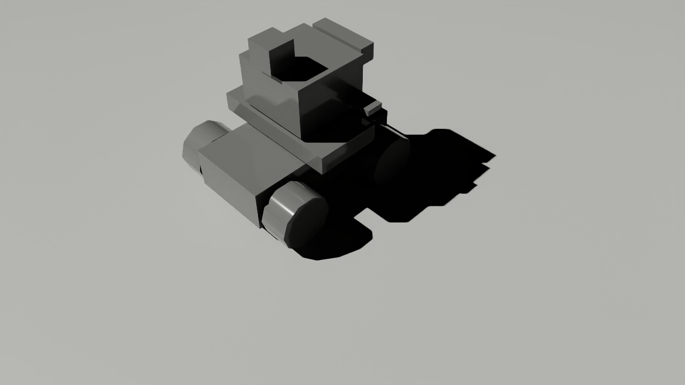
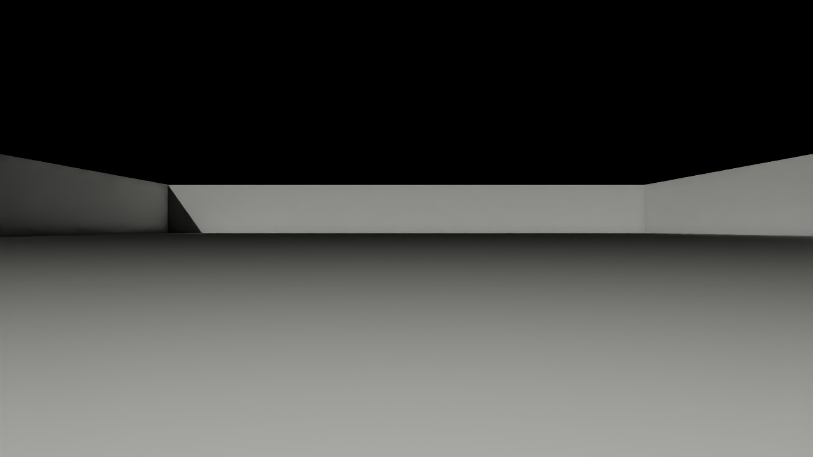
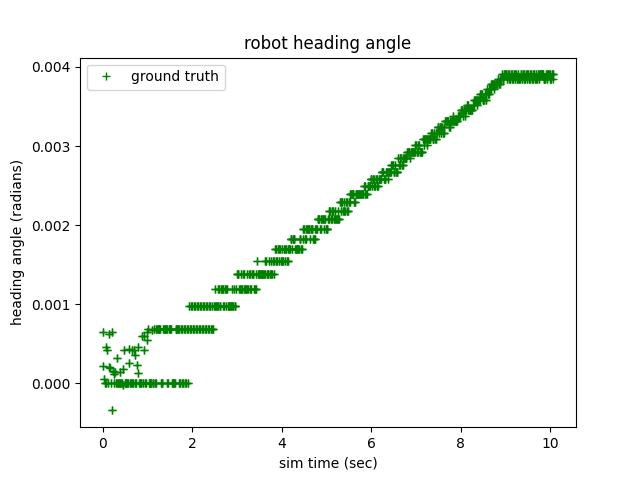

# differential_drive_test

A ROS2 package/node for orchestrating tests of ROS2 simulation nodes and collecting results. Different simulators are ... different ... , and yet we want similar results - presumably. This repo tests some of the behaviors of at least 2 simulators, with the comparison results published back into this README.md on demand (see the Usage section below).

## Installation/Dependencies

Nodes and scripts in this ROS2 package depend upon other ROS2 packages. It is suggested all these repos/packages share the same ROS2 workspace. 

The other ROS2 packages / GitHub repos called by this package are:

[gazebo simulation](https://github.com/StuartGJohnson/gazebo_differential_drive_robot_4wheel)

[isaacsim simulation](https://github.com/StuartGJohnson/isaacsim_differential_drive_robot_4wheel)

The world generation repo is used to generate worlds for robot testing and exploration:

[WorldGeneration](https://github.com/StuartGJohnson/WorldGeneration)

## Usage

The core functionality of this package is in `scripts/check_robot_sim.py`. This ROS2 node is executed as follows:
- Set the appropriate parameters in, for example,`config/sim_check_gazebo.yml`
- Launch each series of tests via:
  <pre>`ros2 run differential_drive_test check_robot_sim.py --config config/sim_check_gazebo.yml`</pre>
  or
  <pre>`ros2 run differential_drive_test check_robot_sim.py --config config/sim_check_isaac.yml`</pre>
- Update the appropriate parameters in, for example, `config/publish.yml`
  - Note this configuration file is typically updated to process the last, uniquely labeled, time-stamped directories of results generated by the simulator runs.
- launch the publish node:
  <pre>`ros2 run differential_drive_test publish_results_node.py --config config/publish.yml`</pre>
    - the publish operation updates tables in this file, but only in tagged sections
    - you may wish to push updates to GitHub. The updates will include simulator output files, copied into this repo by the publish node

These scripts produce various results:
- Robot selfies
- Simulator publish rates of numerous topics, in simulation and wall time
- Simulator/robot transform trees
- Open-loop dynamics tests
- Sensor outputs of RGB camera, depth camera, and lidar. Currently, these are static outputs, collected near the beginning of simulation - after a short post-start-up delay.

As noted above, the publish node will update tables (and figures) in this README.md.

## Simulator Comparisons

### Robot self portrait

#### RGB Camera
<table>
  <tr>
    <td align="center"><b>Gazebo</b></td>
    <td align="center"><b>IsaacSim</b></td>
  </tr>
  <tr>
    <td></td>
    <td></td>
  </tr>
</table>

#### Depth Camera
<table>
  <tr>
    <td align="center"><b>Gazebo</b></td>
    <td align="center"><b>IsaacSim</b></td>
  </tr>
  <tr>
    <td></td>
    <td></td>
  </tr>
</table>

### Transform trees

<table>
  <tr>
    <td align="center"><b>Gazebo</b></td>
  </tr>
  <tr>
    <td></td>
  </tr>
  <tr>
    <td align="center"><b>IsaacSim</b></td>
  </tr>
  <tr>
    <td></td>
  </tr>
</table>

### Sensors - Depth Camera

<table>
  <tr>
    <td align="center"><b>Gazebo</b></td>
    <td align="center"><b>IsaacSim</b></td>
  </tr>
  <tr>
    <td></td>
    <td></td>
  </tr>
</table>

### Sensors - RGB Camera

<table>
  <tr>
    <td align="center"><b>Gazebo</b></td>
    <td align="center"><b>IsaacSim</b></td>
  </tr>
  <tr>
    <td></td>
    <td></td>
  </tr>
</table>

### Sensors - Lidar

<table>
  <tr>
    <td align="center"><b>Gazebo</b></td>
    <td align="center"><b>IsaacSim</b></td>
  </tr>
  <tr>
    <td></td>
    <td></td>
  </tr>
</table>

### Dynamics - Open-Loop control 0m (in-place pivot) radius turn
<!-- TEST4_TABLE_START -->
| sim_type   | odom turn radius(m)   |   gt turn radius(m) | odom heading change(rad)   |   gt heading change(rad): |   sim time change(s) |   wall time change(s) |
|:-----------|:----------------------|--------------------:|:---------------------------|--------------------------:|---------------------:|----------------------:|
| gazebo     | 0                     |                0.04 | 5.03                       |                      5.08 |                10.03 |                 14.75 |
| isaacsim   | -                     |                0.08 | -                          |                      0.96 |                10.03 |                 24.76 |
<!-- TEST4_TABLE_END -->

<table>
  <tr>
    <td align="center"><b>Gazebo</b></td>
    <td align="center"><b>IsaacSim</b></td>
  </tr>
  <tr>
    <td></td>
    <td></td>
  </tr>
</table>

<table>
  <tr>
    <td align="center"><b>Gazebo</b></td>
    <td align="center"><b>IsaacSim</b></td>
  </tr>
  <tr>
    <td></td>
    <td></td>
  </tr>
</table>

### Dynamics - Open-Loop control 1m radius turn

<!-- TEST1_TABLE_START -->
| sim_type   | odom turn radius(m)   |   gt turn radius(m) | odom heading change(rad)   |   gt heading change(rad): |   sim time change(s) |   wall time change(s) |
|:-----------|:----------------------|--------------------:|:---------------------------|--------------------------:|---------------------:|----------------------:|
| gazebo     | 1.0                   |                1    | 5.06                       |                      5.04 |                10.07 |                  14.8 |
| isaacsim   | -                     |               45.99 | -                          |                      0.12 |                 9.98 |                  24.3 |
<!-- TEST1_TABLE_END -->

<table>
  <tr>
    <td align="center"><b>Gazebo</b></td>
    <td align="center"><b>IsaacSim</b></td>
  </tr>
  <tr>
    <td></td>
    <td></td>
  </tr>
</table>

<table>
  <tr>
    <td align="center"><b>Gazebo</b></td>
    <td align="center"><b>IsaacSim</b></td>
  </tr>
  <tr>
    <td></td>
    <td></td>
  </tr>
</table>

### Dynamics - Open-Loop control 2m radius turn
<!-- TEST2_TABLE_START -->
| sim_type   | odom turn radius(m)   |   gt turn radius(m) | odom heading change(rad)   |   gt heading change(rad): |   sim time change(s) |   wall time change(s) |
|:-----------|:----------------------|--------------------:|:---------------------------|--------------------------:|---------------------:|----------------------:|
| gazebo     | 2.0                   |                1.97 | 2.51                       |                      2.45 |                10.03 |                 14.73 |
| isaacsim   | -                     |              297.99 | -                          |                      0.02 |                 9.93 |                 24.43 |
<!-- TEST2_TABLE_END -->

<table>
  <tr>
    <td align="center"><b>Gazebo</b></td>
    <td align="center"><b>IsaacSim</b></td>
  </tr>
  <tr>
    <td></td>
    <td></td>
  </tr>
</table>

<table>
  <tr>
    <td align="center"><b>Gazebo</b></td>
    <td align="center"><b>IsaacSim</b></td>
  </tr>
  <tr>
    <td></td>
    <td></td>
  </tr>
</table>

### Dynamics - Open-Loop control 4m radius turn
<!-- TEST3_TABLE_START -->
| sim_type   | odom turn radius(m)   |   gt turn radius(m) | odom heading change(rad)   |   gt heading change(rad): |   sim time change(s) |   wall time change(s) |
|:-----------|:----------------------|--------------------:|:---------------------------|--------------------------:|---------------------:|----------------------:|
| gazebo     | 4.0                   |                4.46 | 1.25                       |                       1.2 |                10.02 |                 14.81 |
| isaacsim   | -                     |             2197.49 | -                          |                       0   |                10.07 |                 24.46 |
<!-- TEST3_TABLE_END -->

<table>
  <tr>
    <td align="center"><b>Gazebo</b></td>
    <td align="center"><b>IsaacSim</b></td>
  </tr>
  <tr>
    <td></td>
    <td></td>
  </tr>
</table>

<table>
  <tr>
    <td align="center"><b>Gazebo</b></td>
    <td align="center"><b>IsaacSim</b></td>
  </tr>
  <tr>
    <td></td>
    <td></td>
  </tr>
</table>

### Gazebo Sensor and data publish rates

<!-- GAZEBO_DATA_RATE_TABLE_START -->
| topic                        |   count |   wall Hz |   sim Hz |
|:-----------------------------|--------:|----------:|---------:|
| /imu                         |     400 |     13.34 |    20.05 |
| /d435_rgb_camera/image_raw   |     604 |     20.12 |    30.35 |
| /d435_depth_camera/image_raw |     604 |     20.11 |    30.35 |
| /scan                        |     200 |      6.66 |    10.05 |
| /odom                        |    1999 |     66.63 |   100.05 |
| /clock                       |   19930 |    662.7  |   999.85 |
| /tf                          |    2401 |     79.78 |   119.75 |
| /gt_pose                     |    1488 |     49.42 |    74.19 |
<!-- GAZEBO_DATA_RATE_TABLE_END -->

### IsaacSim Sensor and data publish rates
<!-- ISAAC_DATA_RATE_TABLE_START -->
| topic               |   count |   wall Hz |   sim Hz |
|:--------------------|--------:|----------:|---------:|
| /imu                |     400 |     49.83 |   120.6  |
| /rgb_camera/rgb     |     200 |     24.97 |    60.3  |
| /depth_camera/depth |     200 |     25.07 |    60.3  |
| /scan               |     400 |     49.83 |   120.6  |
| /odom               |     400 |     49.83 |   120.6  |
| /clock              |     400 |     49.83 |   120.6  |
| /tf                 |    1194 |    149.45 |   361.82 |
<!-- ISAAC_DATA_RATE_TABLE_END -->
